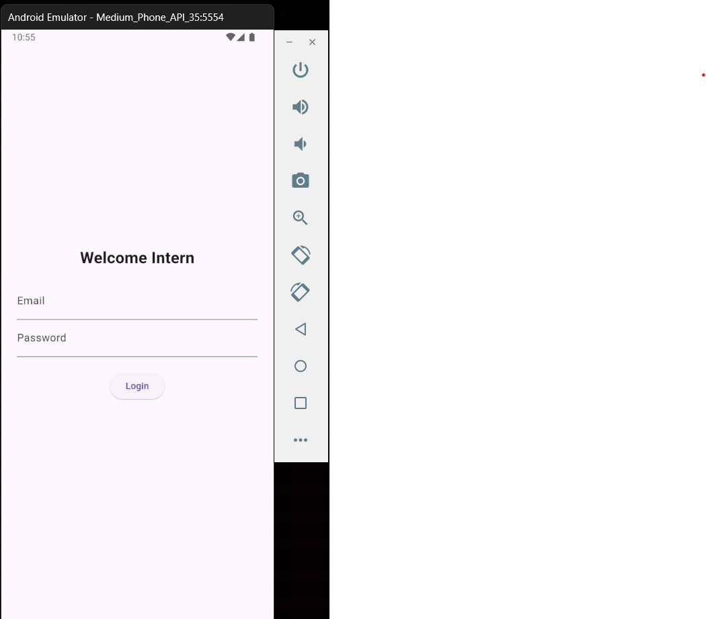
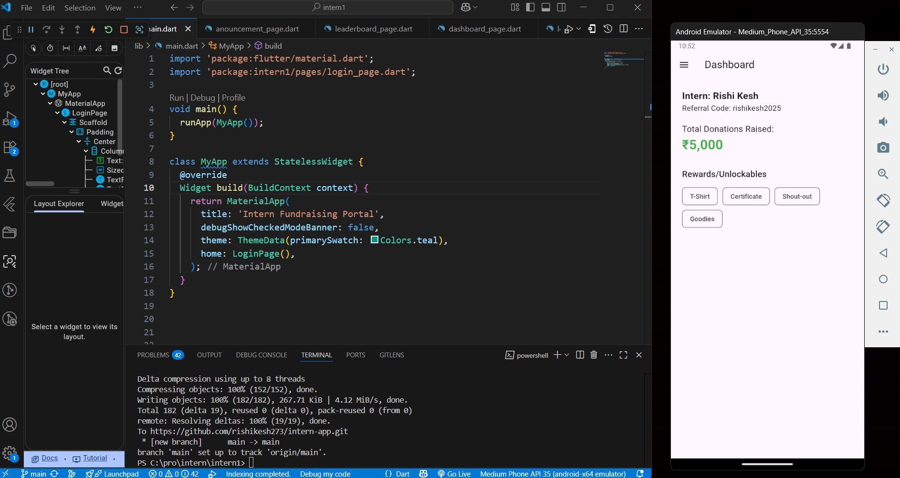
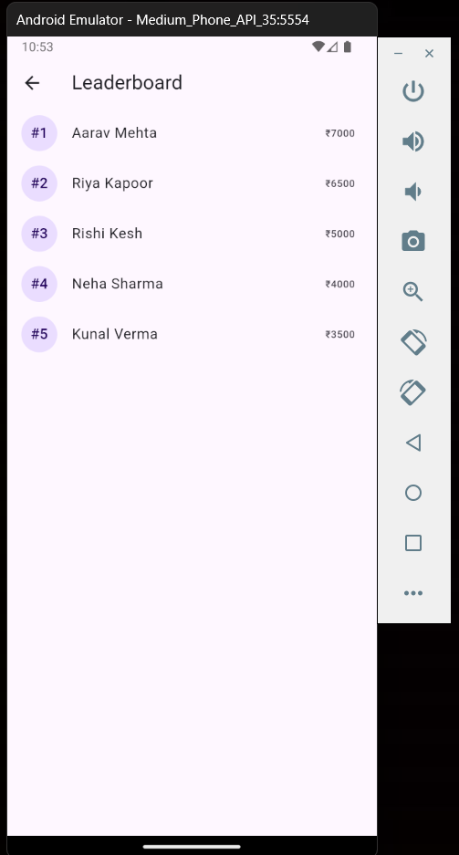

# 🧑‍💻  Intern Project (Flutter)

A simple Flutter UI prototype to Build a Basic Flutter Intern Dashboard App— no backend, only mock data.

## 📱 Features

- 🔐 Login/Sign-Up UI (no auth)
- 📊 Dashboard with intern info, referral code, donations, and rewards
- 🏆 Leaderboard (dummy data)
- 📢 Announcements Page
- 📂 Navigation Drawer with Logout option

## 🚀 How to Run

1. Clone the repo  
2. Run `flutter pub get`  
3. Execute `flutter run`  

## 📷 Screenshots

### 🔐 Login Page

### 📊 Dashboard

### 🏆 Leaderboard

## 🛠️ Tech Stack

- Flutter
- Dart

---

## 🧑 Author

**Rishi Kesh**
